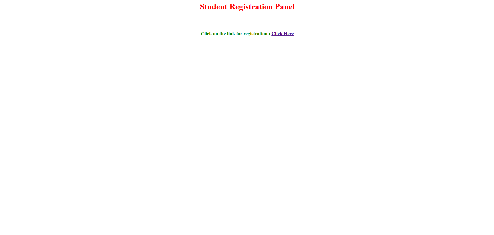
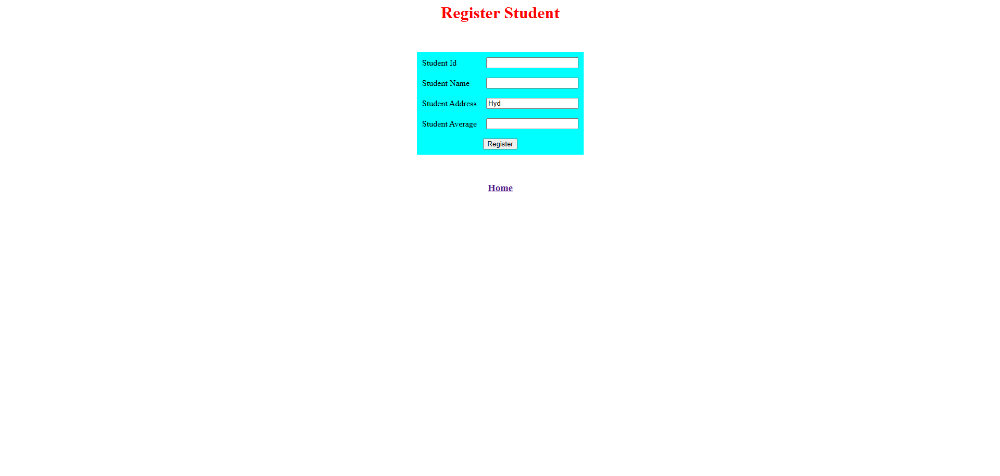
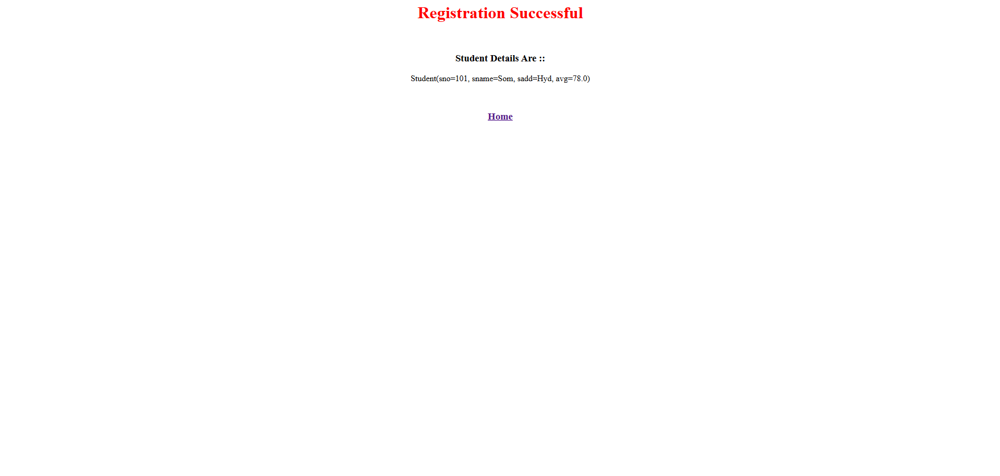

# Spring Boot MVC – Student Registration (Learning Project)

This is a **learning project** developed to understand **Spring Boot MVC** using **JSP** and **Spring Form Tags**.  
The application implements a simple **Student Registration** flow to practice model binding and MVC concepts.

---

## Objective of This Project

The main goal of this project is to learn:

- Spring MVC request flow
- JSP integration with Spring Boot
- Spring `<form:*>` (MVC form tags)
- `@ModelAttribute` for data binding
- Default values in model classes
- GET and POST request handling

---

## Technologies Used

- Java 21
- Spring Boot 3.x
- Spring MVC
- JSP
- Apache Tomcat 11
- Maven
- Spring Tool Suite (STS)

---

## Project Structure

```
src
└── main
├── java
│ └── com.boot.mvc
│ ├── controller
│ │ └── StudentController.java
│ └── model
│ └── Student.java
└── webapp
└── WEB-INF
└── pages
├── welcome.jsp
├── registration_form.jsp
└── result.jsp
```


---

## Student Model

```java
public class Student {

    private Integer sno;
    private String sname;
    private String sadd = "Hyd";   // default value
    private Float avg;

    // getters and setters
}
```
Learning Point
The sadd field is initialized with "Hyd", so this value appears automatically in the registration form when the page loads.

---

## Controller
```java
@Controller
public class StudentController {

    @GetMapping
    public String showHome() {
        return "welcome";
    }

    @GetMapping("/register")
    public String registerStudentPage(@ModelAttribute("stud") Student st) {
        return "registration_form";
    }

    @PostMapping("/register")
    public String studentRegister(@ModelAttribute("stud") Student st) {
        System.out.println(st);
        return "result";
    }
}
```
---

### Key Learnings
  - @ModelAttribute prepares the form backing object
  - Same attribute name (stud) is used in JSP
  - GET method loads the registration form
  - POST method binds form data to the model object

---

### JSP – Registration Form
- Uses Spring <form:form> instead of HTML <form>
- Uses <form:input> for automatic data binding
- No manual request parameter handling is required

## Screenshots

### Student Registration Welcome Page

- Acts as the entry point of the application and guides the user to the registration process.
- Provides a simple navigation link to the Student Registration page using Spring MVC routing.
- Helps understand basic @GetMapping request handling and view resolution in Spring MVC.

### Student Registration Form

- The registration page created using Spring MVC form tags.
- The Student Address field is pre-filled with Hyd from the model class.

### Registration Success Page

- After submitting the form, the entered data is bound to the Student object and shown on the success page.

## Application Flow

- User opens the Home page
- Navigates to the Registration page
- Form loads with default address value
- User enters student details
- Form is submitted
- Data binds to Student object
- Result page displays student details

## Concepts Learned

- Spring MVC architecture
- Model–View–Controller separation
- Form handling using Spring MVC tags
- Data binding using @ModelAttribute
- Default model values in JSP
- GET vs POST request handling
